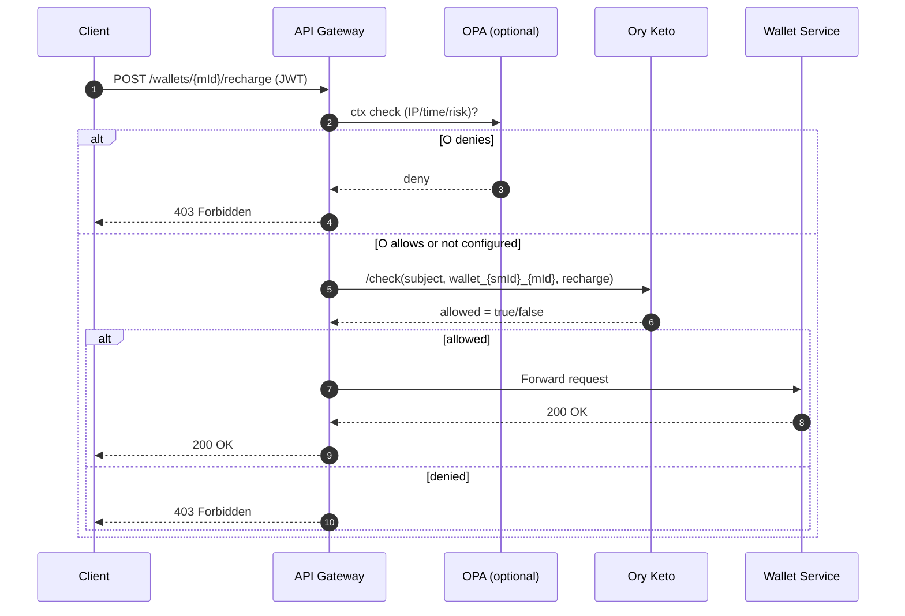
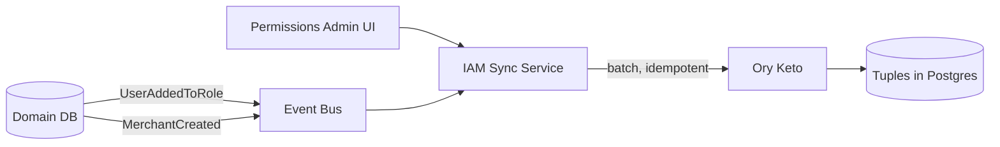
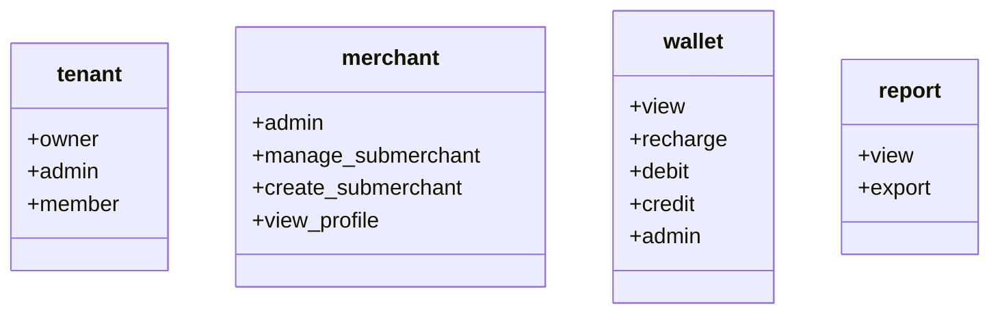

# Ory Keto–Backed Authorization Architecture (Fintech, 10 Products, 100k Users)

> Developer-facing documentation for implementing **relationship-based access control (ReBAC)** with **Ory Keto** across a distributed fintech stack (User, Wallet, Reports, API services, etc.). Includes modeling patterns, request mapping, examples at scale, and operational guidance.

---

## 1) Why Keto for this system

We need **fine-grained, multi-tenant, easily bulk-editable permissions** across many services. Keto provides:
- **Relation tuples** (“who can do what on which resource”), i.e., **Zanzibar-style** authorization.
- A low-latency **Check API** (`allowed?`) we can call at the **API Gateway**.
- Clean separation of concerns: **IdP (AuthN)** issues JWTs; **Keto (AuthZ)** decides permissions.
- Simple **horizontal scaling** (stateless) and DB-backed tuple storage.

---

## 2) System components (high-level)

- **IdP (AuthN)**: Keycloak/Zitadel/Auth0 → issues JWT (user id, tenant id, roles, optional claims).
- **API Gateway**: Envoy/Kong/Traefik → authenticates JWT, **maps request to (namespace, object, relation)**, asks Keto.
- **Ory Keto (PDP)**: Stores **relation tuples** & answers **/check**.
- **Microservices**: Wallet/Reports/API/etc. → trust gateway; optionally double-check Keto for sensitive actions.
- **IAM Sync service**: Converts domain events (UserAddedToRole, MerchantCreated) into **tuple upserts** (bulk, idempotent).
- **Permissions Admin UI**: Operates on **role groups** and **grants** (via IAM Sync).

### 2.1 Architecture (Mermaid)

```mermaid
graph TD
  A[Client (Browser/App)] -->|JWT| G[API Gateway]
  subgraph Edge
    G -->|ext_authz -> /check| K[Ory Keto]
    G -->|optional ctx check| O[OPA/Rego]
  end

  G --> S1[Wallet Service]
  G --> S2[Reports Service]
  G --> S3[API Service]
  S1 -->|optional critical double-check| K
  S2 -->|optional critical double-check| K

  subgraph IAM Plane
    UI[Permissions Admin UI] --> IS[IAM Sync Service]
    DB[(Domain DB: Users, Merchants, Roles)] --> EVT[Event Bus (Kafka/Rabbit)]
    EVT --> IS
    IS -->|bulk upserts| K
  end

  K --> P[(Tuples Storage: Postgres)]
```

---

## 3) Authorization model (ReBAC)

### 3.1 Subjects
- **Users**: `user:<uuid>`  
- **Service accounts**: `service:<name>` (M2M)  
- **Groups** (modeled as *subject sets*, not a special type):
  - `group:platform:superadmins`
  - `group:tenant:<smId>:admins`
  - `group:merchant:<mId>:admins`
  - `group:merchant:<mId>:submerchants`
  - `group:product:<productId>:role:<roleName>` (e.g., `wallet:cashier`, `report:viewer`)

> **Always grant to groups; never directly to individual users** unless absolutely necessary. This enables O(1) bulk edits.

### 3.2 Namespaces & relations (per product/domain)
Start with one namespace per product/domain. Typical relations (capabilities):

- `tenant` → `owner`, `admin`, `member`
- `merchant` → `admin`, `manage_submerchant`, `create_submerchant`, `view_profile`
- `wallet` → `view`, `recharge`, `debit`, `credit`, `admin`
- `report` → `view`, `export`
- `api` → `invoke` (or verb-scoped like `call:get`, `call:post`)

> Add more as new products arrive (`payout`, `settlement`, `recon`, `kyc`, …).

### 3.3 Object ID conventions (tenancy baked-in)

To prevent cross-tenant leakage **by construction**, object IDs embed the tenant/merchant:

- `tenant:<smId>`
- `merchant:<smId>_<mId>` – Merchant **under** a SuperMerchant
- `merchant:<mId>` – Standalone merchant (no SuperMerchant)
- `wallet:wallet_<smId>_<mId>`
- `report:report_<smId>_<mId>`
- `payout:payout_<smId>_<mId>`

> Support both merchant modes by mapping request paths to the correct object pattern.

### 3.4 Relation tuples (the grants)

**Format**: `namespace:object#relation@subject`

Examples implementing your scenarios:

```text
# Platform-level
tenant:*#admin@group:platform:superadmins
tenant:sm_1#admin@group:tenant:sm_1:admins

# Merchant m_42 under tenant sm_1
merchant:sm_1_m_42#admin@group:merchant:m_42:admins
merchant:sm_1_m_42#member@group:merchant:m_42:submerchants

# Wallet & Reports for merchant m_42
wallet:wallet_sm_1_m_42#recharge@group:merchant:m_42:role:cashier
report:report_sm_1_m_42#view@user:submerchant_A

# Standalone merchant m_99 (no super merchant)
merchant:m_99#admin@user:merchant_owner_7
wallet:wallet_m_99#view@group:merchant:m_99:submerchants
```

---

## 4) Request → (namespace, object, relation) mapping

Implement a deterministic mapping at the **Gateway ext-authz** layer:

| HTTP | Path                                  | Namespace | Object ID                    | Relation  |
|------|---------------------------------------|-----------|------------------------------|-----------|
| POST | /wallets/{merchantId}/recharge        | wallet    | wallet_{smId}_{mId}          | recharge  |
| POST | /wallets/{merchantId}/debit           | wallet    | wallet_{smId}_{mId}          | debit     |
| GET  | /reports/{merchantId}                 | report    | report_{smId}_{mId}          | view      |
| POST | /merchants/{merchantId}/submerchants  | merchant  | {smId}_{mId}                 | create_submerchant |

- **Subject** = `user:<jwt.sub>` (human) or `service:<name>` (M2M).
- If merchant is standalone, omit `smId` → use `merchant:<mId>` and `wallet:wallet_<mId>` patterns.

### 4.1 Sequence (Mermaid)



---

## 5) Contextual ABAC (time/IP/risk) without bloating Keto

- Keep **relationships** in Keto.
- Keep **conditions** in **OPA** (Envoy external auth plugin), e.g.:
  - Branch IP allowlist
  - Business hours windows
  - AML/KYC risk flags / velocity

> Separation keeps Keto fast & simple; OPA rules are short and CI/CD-friendly.

---

## 6) IAM Sync (events → tuples)



Responsibilities:
- Translate business events into **create/update/delete tuples**.
- Provide **bulk operations** to Admin UI (e.g., “grant cashier role for 1,200 merchants”).  
- **Idempotent** and **batched** writes.  
- Manage **cache invalidation** events for the gateway authz cache when large edits occur.

---

## 7) Examples @ scale (10 products, 100k users)

**Assumptions**:  
- 10 products × ~5 relations (≈50 capabilities)  
- 1,000 merchants total  
- Each user in ~2 product roles on average

**Tuple counts (order-of-magnitude)**:  
- Group memberships: ~**200k** (100k × 2)  
- Grants to groups per merchant/product/role: ~**40k** (1,000 × 10 × 4)  
- Total typically **< 500k tuples** (very manageable).

**Latency**: Gateway uses **short TTL cache (3–10s)**. Expect very low-ms checks on cache hit; Keto check on miss is still fast.  
**Availability**: Keto is stateless; run 2–3 replicas; DB HA (primary + replica).

---

## 8) Example Ory Keto setup (dev)

> The following uses **illustrative** endpoints and bodies. Adjust for your Keto version and environment.

### 8.1 Seed relation tuples (HTTP)

```bash
# Platform superadmins can admin any tenant
curl -X POST $KETO_WRITE/relation-tuples \
  -H "Content-Type: application/json" \
  -d '{ "namespace":"tenant","object":"*","relation":"admin","subject":"group:platform:superadmins" }'

# Tenant sm_1 admins
curl -X POST $KETO_WRITE/relation-tuples \
  -H "Content-Type: application/json" \
  -d '{ "namespace":"tenant","object":"sm_1","relation":"admin","subject":"group:tenant:sm_1:admins" }'

# Merchant sm_1_m_42 admins & submerchants
curl -X POST $KETO_WRITE/relation-tuples \
  -H "Content-Type: application/json" \
  -d '{ "namespace":"merchant","object":"sm_1_m_42","relation":"admin","subject":"group:merchant:m_42:admins" }'

curl -X POST $KETO_WRITE/relation-tuples \
  -H "Content-Type: application/json" \
  -d '{ "namespace":"merchant","object":"sm_1_m_42","relation":"member","subject":"group:merchant:m_42:submerchants" }'

# Wallet & Reports grants for merchant m_42
curl -X POST $KETO_WRITE/relation-tuples \
  -H "Content-Type: application/json" \
  -d '{ "namespace":"wallet","object":"wallet_sm_1_m_42","relation":"recharge","subject":"group:merchant:m_42:role:cashier" }'

curl -X POST $KETO_WRITE/relation-tuples \
  -H "Content-Type: application/json" \
  -d '{ "namespace":"report","object":"report_sm_1_m_42","relation":"view","subject":"user:submerchant_A" }'
```

### 8.2 Permission checks

```bash
# Can submerchant_A view reports for m_42?
curl -X POST $KETO_READ/relation-tuples/check \
  -H "Content-Type: application/json" \
  -d '{ "namespace":"report","object":"report_sm_1_m_42","relation":"view","subject":"user:submerchant_A" }'

# Can submerchant_A recharge wallet for m_42?
curl -X POST $KETO_READ/relation-tuples/check \
  -H "Content-Type: application/json" \
  -d '{ "namespace":"wallet","object":"wallet_sm_1_m_42","relation":"recharge","subject":"user:submerchant_A" }'
```

> Expect **true** for the first (we granted report:view directly), **false** for the second unless the user is in `group:merchant:m_42:role:cashier`.

### 8.3 Gateway ext-authz (pseudo-code)

```java
// Pseudocode for Spring Cloud Gateway filter
String subject   = "user:" + jwt.getSubject();              // or "service:<name>" for M2M
String tenantId  = claims.get("tenant_id");                 // optional if standalone merchant
String merchantId= pathVar("merchantId");

Map<RouteKey, Mapping> table = loadMapping();               // path+method -> (ns, objFmt, relation)

Mapping m = table.resolve(request);
String namespace = m.namespace();                           // e.g., "wallet"
String objectId  = m.objectId(tenantId, merchantId);        // e.g., "wallet_sm_1_m_42"
String relation  = m.relation();                            // e.g., "recharge"

DecisionKey dk = new DecisionKey(subject, namespace, objectId, relation);
Boolean cached = cache.get(dk);
if (cached == null) {
  boolean allowed = keto.check(subject, namespace, objectId, relation);
  cache.put(dk, allowed, Duration.ofSeconds(5));
  if (!allowed) return forbidden();
} else {
  if (!cached) return forbidden();
}
return forward();
```

### 8.4 Optional OPA (Rego) snippet for conditions

```rego
package authz.context

default allow = false

deny { input.ctx.merchant_status == "frozen" }

within_hours {
  input.ctx.hour >= 9
  input.ctx.hour < 19
}

allow {
  not deny
  within_hours
}
```

---

## 9) Admin & bulk changes (patterns)

- **Add user to role**: `group:merchant:m_42:role:cashier` ⇐ `user:<id>` → instant effect platform-wide where bound.
- **Shift capability** for a role (bulk): swap one tuple on the object:
  - `report:report_sm_1_m_42#view@group:merchant:m_42:role:cashier`
  - → `wallet:wallet_sm_1_m_42#recharge@group:merchant:m_42:role:cashier`
- **Freeze merchant**: either remove a single binding group used in all grants, or **OPA deny** if `merchant_status=frozen` and purge gateway cache.

---

## 10) Ops: scale, HA, and cost posture

- **Keto**: 2–3 replicas (stateless), liveness/readiness checks, horizontal scale.
- **DB**: Postgres (primary + read replica). Tuples are small; use HA for durability.
- **Cache**: Edge LRU with 3–10s TTL. (Optional Redis if many gateways.)
- **Observability**: Log `(subject, ns, object, relation, decision)` at the gateway; metrics for cache hit ratio, p95 latency, Keto errors.
- **Security**: Validate JWT at edge; mTLS to Keto; fail-closed on sensitive routes; normalize mapping to avoid path tricks.

**Directional monthly cost (self-hosted single region HA)**: low hundreds USD/month (DB tier dominates). SaaS (Ory Network) has published entry tiers; pick based on DAU vs ops comfort.

---

## 11) Developer quickstart (this week)

1) Finalize first 2 namespaces (`wallet`, `report`) & relations.  
2) Implement route → `(ns,obj,rel)` mapping table in gateway.  
3) Stand up Keto + Postgres (docker-compose for dev).  
4) Build ext-authz adapter (with 5s LRU cache) → Keto `/check`.  
5) Seed tuples for one tenant + merchant (examples above).  
6) Run **shadow mode** (log-only).  
7) Enforce for read-only endpoints first, then money-moving ones.  
8) Add OPA for IP/time/risk where needed.

---

## 12) Mermaid appendix: Namespace cheat sheet



```mermaid
erDiagram
  SUBJECTS {
    string user_id
    string service_name
  }
  GROUPS {
    string group_id
  }
  OBJECTS {
    string namespace
    string object_id  // includes tenant/merchant
  }
  RELATIONS {
    string relation   // capability
  }

  SUBJECTS ||--o{ GROUPS : "member_of"
  GROUPS ||--o{ RELATIONS : "granted"
  RELATIONS ||--o{ OBJECTS : "on"
  SUBJECTS ||--o{ RELATIONS : "direct_grant"
```

---

### Notes
- Treat the examples as **templates**. Keto evolves; validate CLI/endpoint shapes for your selected version.
- Keep **role/group naming** consistent and human-readable (it helps support & audits).
- Prefer **group-based grants** always; reserve per-user grants for emergencies only.
