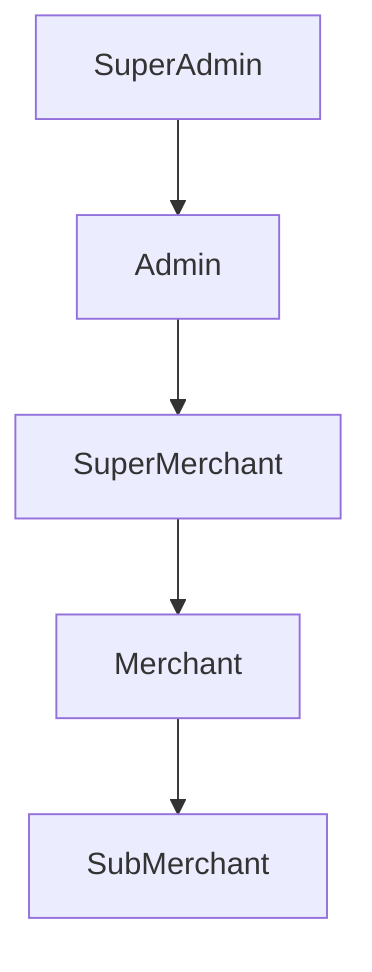

# 🧩 User Service Role Hierarchy and Access Control

This document defines the **role hierarchy**, **permissions**, and **resource access** model for the **User Service** in the Merchant Portal ecosystem.  
It is designed for integration with **Ory Keto (ReBAC)** and supports **future scalability (20+ resources)** without requiring user re-registration.

---

## 🧱 Role Hierarchy Overview

Roles are structured in a **top-down hierarchy**, where higher roles inherit all permissions of lower roles.



### Inheritance Logic
- **SuperAdmin** → Inherits all access (Admin + SuperMerchant + Merchant + SubMerchant)
- **Admin** → Inherits all access (SuperMerchant + Merchant + SubMerchant)
- **SuperMerchant** → Inherits (Merchant + SubMerchant)
- **Merchant** → Inherits (SubMerchant)
- **SubMerchant** → Has the least privileged access (restricted to their own data)

---

## 🧠 Role Capabilities

### 🟣 SuperAdmin
> System-wide owner and full access to **all resources** and **administrative operations**.

**Capabilities:**
- Manage all users and roles (CRUD)
- Manage all merchant applications and documents
- Create, assign, and revoke permissions (Keto tuples)
- Manage configuration (system settings, profiles, limits)
- View, approve, or reject any merchant/submerchant onboarding
- Generate reports and audit logs
- Access every API endpoint

**Example Keto Tuples:**
```json
{
  "namespace": "system",
  "object": "*",
  "relation": "*",
  "subject_set": {
    "namespace": "roles",
    "object": "superadmin",
    "relation": "member"
  }
}
```

---

### 🔵 Admin
> Manages operations delegated by SuperAdmin, focused on platform and merchant oversight.

**Capabilities:**
- Manage merchants and supermerchants (CRUD)
- Approve or reject merchant onboarding
- Manage payment configurations
- View system analytics
- Read-only access to user data
- Cannot delete SuperAdmin records

**Example Keto Tuple:**
```json
{
  "namespace": "merchant_application",
  "object": "*",
  "relation": "manage",
  "subject_set": {
    "namespace": "roles",
    "object": "admin",
    "relation": "member"
  }
}
```

---

### 🟢 SuperMerchant
> A verified merchant group head; manages their network of merchants and submerchants.

**Capabilities:**
- Create, update, and view merchant applications
- Manage merchants under their organization
- View transaction reports and settlement data
- Cannot modify Admin or SuperAdmin data
- Cannot delete merchant applications owned by others

**Example Keto Tuple:**
```json
{
  "namespace": "merchant_application",
  "object": "*",
  "relation": "*",
  "subject_set": {
    "namespace": "roles",
    "object": "supermerchant",
    "relation": "member"
  }
}
```

---

### 🟠 Merchant
> Individual business entity onboarded by a SuperMerchant.

**Capabilities:**
- Submit merchant application
- Update business and KYC details
- Access payment links, transactions, and refunds
- Read-only access to reports
- Cannot onboard new users or manage roles

**Example Keto Tuple:**
```json
{
  "namespace": "merchant_application",
  "object": "*",
  "relation": "can_submit",
  "subject_set": {
    "namespace": "roles",
    "object": "merchant",
    "relation": "member"
  }
}
```

---

### 🟡 SubMerchant
> Child account under a Merchant or SuperMerchant, restricted access scope.

**Capabilities:**
- View assigned merchant applications
- Access limited transaction and settlement data
- Submit documents or update their own profile only
- No create/update access to others’ resources

**Example Keto Tuple:**
```json
{
  "namespace": "merchant_application",
  "object": "*",
  "relation": "view",
  "subject_set": {
    "namespace": "roles",
    "object": "submerchant",
    "relation": "member"
  }
}
```

---

## ⚙️ Access Management Logic

| Action | SuperAdmin | Admin | SuperMerchant | Merchant | SubMerchant |
|--------|-------------|--------|----------------|-----------|--------------|
| Create Users | ✅ | ✅ | ❌ | ❌ | ❌ |
| Create Merchant Application | ✅ | ✅ | ✅ | ✅ | ❌ |
| Update Merchant Application | ✅ | ✅ | ✅ | ✅ | ❌ |
| Delete Merchant Application | ✅ | ✅ | ❌ | ❌ | ❌ |
| View Reports | ✅ | ✅ | ✅ | ✅ | ✅ |
| Manage Roles | ✅ | ✅ | ❌ | ❌ | ❌ |
| Access All Data | ✅ | ✅ | ❌ | ❌ | ❌ |

---

## 🔄 Future Resource Access (Dynamic Scaling)

Once a user registers, their **Cognito group → Keto role mapping** ensures automatic access propagation:

| Resource Type | Namespace | Inherited From |
|----------------|------------|----------------|
| Merchant Application | `merchant_application` | SuperMerchant |
| Payment Service | `payment_service` | Merchant |
| Refunds | `refunds` | Merchant/SubMerchant |
| Reports | `reports` | All roles |
| Disputes | `disputes` | Admin/SuperAdmin |
| Notifications | `notifications` | All |
| Onboarding | `onboarding` | SuperMerchant/Admin |
| API Keys | `apikeys` | SuperMerchant/Admin |

No re-registration is needed. Once a user is part of a role/group in Cognito, **Ory Keto** dynamically resolves their access to new resources.

---

## 🧩 Integration Summary

- **Identity**: AWS Cognito (manages authentication and group membership)
- **Authorization**: Ory Keto (manages permission tuples)
- **Microservices**: Each service uses Keto `/check` or `/expand` APIs to enforce access
- **Data Sync**: Once registered, user roles propagate automatically to all microservices via Cognito → Keto mapping.

---

## 📘 Example Authorization Flow

1. User logs in via AWS Cognito  
2. Cognito JWT includes `cognito:groups` claim (e.g., `["SUPERMERCHANT"]`)  
3. Spring Boot extracts group → checks against Keto `/check` endpoint  
4. Keto validates tuple (e.g., `roles:supermerchant -> merchant_application:*`)  
5. API grants or denies access dynamically

---

## 🧾 Next Steps

- Add new resource namespaces for additional microservices (e.g., `inventory`, `payouts`, `chargebacks`)  
- Maintain tuple hierarchy in **Keto DB** for dynamic propagation  
- Define granular relations (e.g., `can_edit`, `can_delete`, `can_refund`)  
- Create automation scripts to bootstrap role tuples via `/api/superadmin/bootstrap`

---

> 🧠 **Tip:** You can visualize or modify this role model directly in **Obsidian** using Mermaid’s live preview mode.
